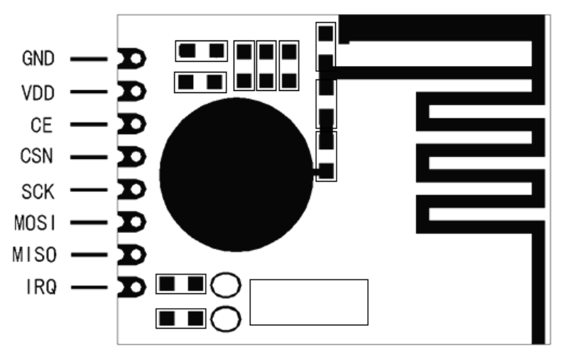

Hardware
========
Datasheet define following pinout for RFM75 chip:

Next image demonstrate how RFM75 chip could be connected to Adafruit FT232H board

Make sure that you use 3.3v power supply for your RFM device. Some Adafruit boards have 3.3v pin, in this case LDO is not required.